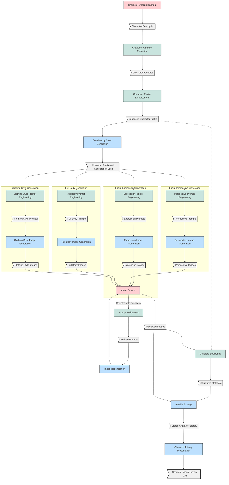

# Character Creator Workflow Documentation

This repository contains the documentation and resources for the Character Creator Workflow.

## Workflow Diagram

The workflow diagram is created using Mermaid. You can view it in several ways:

1. **GitHub Preview**: GitHub automatically renders Mermaid diagrams in markdown files. You can see it below:

2. **Mermaid Live Editor**: You can also view and edit the diagram using the [Mermaid Live Editor](https://mermaid.live). Just copy the contents of the `workflow-diagram.mmd` file and paste it there.

## Color Code Legend

- 🟦 Blue (#bde0fe): Integration Nodes
- 🟩 Green (#c9e4de): AI Agent Nodes
- 🟥 Red (#ffcfd2): Human in the Loop Nodes
- ⬜ Gray (#f1f1f1): Documents/Data

## Styles

The `styles.css` file contains the styling information for the Google Doc version of this documentation.